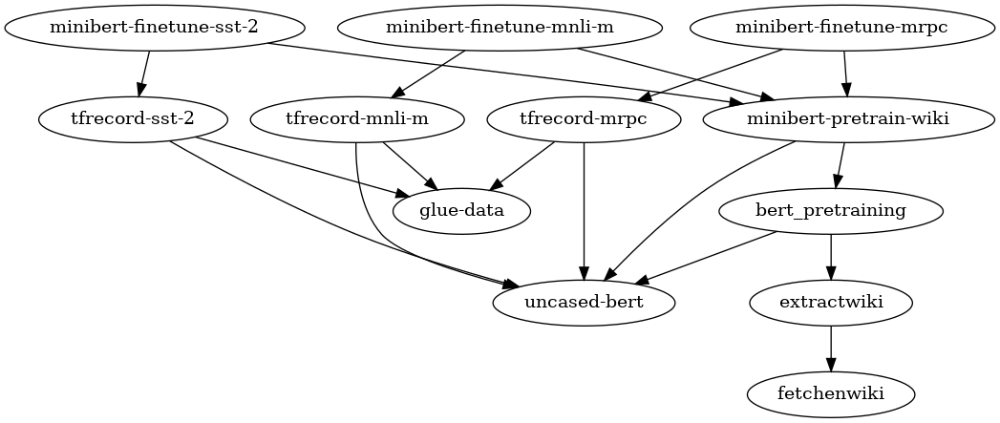

StagedML
========

StagedML brings manageability into Deep Learning by applying
[Nix](https://nixos.org/nix) ideas of software deployment to the domain of ML
model libraries. The project is currenlty focused on NLP models which often
require complex pre-processing and long training. StagedML uses minimalistic
immutable data management engine named
[Pylightnix](https://github.com/stagedml/pylightnix).


StagedML formalizes the concepts of model configuration and dependency, provides
stable grounds for experimentation by tracking realizations. In contrast to regular
package managers, StagedML takes possible non-determenism of training into account.


*<p align=center>Stage configuration dependencies related to BERT
fine-tuning ([Source](./run/depgraph/depgraph.py#L48))</p>*

Contents
--------

1. [Features](#Features)
2. [Requirements](#requirements)
2. [Install](#Install)
   - [General information](#general-information)
   - [User track](#install-user-track)
   - [Developer track](#install-developer-track)
3. [Quick Start](#quick-start)
   - [Build sample report](#build-sample-report)
   - [Work with models](#work-with-models)
4. [Documentation](#documentation)
   - [About Pylightnix](#about-pylightnix)
   - [Repository structure](#repository-structure)
5. [Models and experiments](#models-and-experiments)


Features
--------

* StagedML is a library of adopted ML models. We do not claim any remarkable
  accuracy or performance achievements, but we do provide infrastructure
  properties which as we hope simplify the processes of development end
  experimentation.
  1. StagedML is powered by [Pylightnix](https://github.com/stagedml/pylightnix/)
     immutable data management library.
     ```python
     >>> from stagedml.stages.all import ( all_convnn_mnist, realize,
     >>>     instantiate, rref2path, shell, mklens )
     ```
  2. Models and datasets are defined on top of linked graph of Pylightnix core
     objects called
     [stages](https://github.com/stagedml/pylightnix/blob/master/docs/Reference.md#pylightnix.types.Derivation).
     A Stage is a direct analogy of a package manager's package.
  3. _Stage_ objects are defined by python functions and could be created
     (realized) in just one line of Python code. Dependencies between stages are
     encoded by passing special handlers called _derivation references_ .For
     example, here we realize an object representing trained MNIST classifier:
     ```python
     >>> rref=realize(instantiate(all_convnn_mnist))
     >>> rref
     'rref:2bf51e3ce37061ccff6168ccefac7221-3b9f88037f737f06af0fe82b6f6ac3c8-convnn-mnist'
     ```
  4. StagedML re-uses as much _stage_ realizations as possible. If no
     realization match the criteria, the user-defined building procedure is
     called. For ML models, this results it training of new model instances. For
     datasets this may launch pre-processing or downloading from the Internet.
  5. For every _stage_, user could access it's configuration fields and the
     configuration filelds of any of it's dependencies:
     ```python
     >>> mklens(rref).learning_rate.val   # Learning rate of the model
     0.001
     >>> mklens(rref).mnist.url.val       # URL of the dataset used to train the model
     'https://storage.googleapis.com/tensorflow/tf-keras-datasets/mnist.npz'
     ```
  6. StagedML **evaluates all the configurations before executing all the
     builders**. Thanks to this feature, equipped with
     [Lenses](https://github.com/stagedml/pylightnix/blob/master/docs/Reference.md#lens-objects)
     and
     [Promises](https://github.com/stagedml/pylightnix/blob/master/docs/Reference.md#pylightnix.types.PromisePath),
     we could catch configuration-time errors like misspelled parameter names
     and or incorrect paths before starting long training.
  7. StagedML offers facilities to re-define existing stages and compose new
     stages by using old ones as dependencies. Already existing stages couldn't
     be altered or lost in this process:
     ```python
     >>> from pylightnix import redefine, mkconfig
     >>> def _new_config(old_config):
     >>>   old_config['learning_rate'] = 1e-5
     >>>   return mkconfig(old_config)
     >>> rref5=realize(instantiate(redefine(all_convnn_mnist, new_config=_new_config)))
     >>> rref5
     'rref:1ece593a8e761fa28fdc0da0fed00eb8-dd084d4a8b75a787b7c230474549e5db-convnn-mnist'
     >>> mklens(rref5).learning_rate.val
     1e-05
     ```
  8. Thanks to the [REPL
     API](https://github.com/stagedml/pylightnix/blob/master/docs/Reference.md#pylightnix.repl),
     it is possible to debug intermediate stages by instructing Pylightnix to
     pause at certain building procedures. Using this API is similar to what we
     experience during `git-rebase --continue` workflow. An example is [REPL
     demo of
     Pylightnix](https://github.com/stagedml/pylightnix/blob/master/docs/demos/REPL.md).
  9. StagedML supports non-determenistic build processes which means that we
     could train several instances of the model and pick up the best one to use
     in subsequent stages. Selection criteria are up to the user. See `Matcher`
     topic of the Pylightnix documentation.
     ```python
     >>> rref2path(rref)
     '/tmp/pylightnix/store-v0/3b9f88037f737f06af0fe82b6f6ac3c8-convnn-mnist/2bf51e3ce37061ccff6168ccefac7221'
     # ^^^ Storage root        ^^^ Stage configuration                       ^^^ Stage realization (one of)
     ```
  10. The only way to remove data in StagedML is to use a garbage
      collector. GC removes unused stages but keeps the stages which are pointed
      to by at least one symlink originated from special `experiments` directory.

* Currently, we include some NLP models from
  [tensorflow-models](https://github.com/tensorflow/models), other libraries may
  be supported in future. Often we pick only BASE versions which could be
  trained on GPU. Check the [full collection of adopted
  models and datasets](./src/stagedml/stages/all.py)
* Deployment of trained models is not supported now but may be supported in
  future. Thanks to the simplicity of Pylightnix storage format, the deployment
  could probably be done just by running `rsync` on the Pylightnix storage
  folders of the source and target machines.
* StagedML is not tested as thoroughly as we wish it should be. At
  the same time:
  - To minimize the uncertainty, we specify the exact versions of dependency
    libraries (TensorFlow, TensorFlow Models, Pylightnix, etc.) by linking them
    as Git submodules.
  - The considerable efforts were made to test the underlying Pylightnix
    core library.
  - We extensively use [Mypy](http://mypy-lang.org/)-compatible type annotations.

Requirements
------------

* Linux system as Docker host (other OS may accidently work too)
* GPU suitable for machine learning acceleration. We use NVidia 1080Ti.
* Considerable amount of hard drive space. Some tasks, like BERT pretraining,
  may require >=200 Gb datasets.

Install
-------

### General information

StagedML depends on slightly customized versions of TensorFlow and
TensorFlow/models. While TensorFlow changes are negligible (minor fixes in build
system), we do modify TensorFlow/models
[in a non-trivial way](https://github.com/tensorflow/models/pulls?q=is%3Apr+author%3Agrwlf+is%3Aclosed).

Currently, we provide StagedML in Docker containers of two kinds: 'User' and
'Dev':

| Feature              | stagedml/user  | stagedml/dev   |
|:-------------------- |:--------------:|:--------------:|
| Where to get         | Docker hub     | `docker build` |
| Cloned repo is required  | No         | Yes            |
| Pylightnix installed | System-wide    | via PYTHONPATH |
| StagedML installed   | System-wide    | via PYTHONPATH |
| TensorFlow installed | System-wide    | No(1)          |
| TF/Models installed  | System-wide    | via PYTHONPATH |

* (1) - TensorFlow can't be populated by setting PYTHONPATH, so the
  installation from source is required. We provide reference scripts for this
  task.

Depending on your needs, you could follow either a user or a developer
installation track.

Latest docker images should be available at our [Docker Hub
page](https://hub.docker.com/repository/docker/stagedml/user).

For reference: there is an
[update-docker-hub.sh](./scripts/update-docker-hub.sh) script which automates
the procedure of 'user'-docker image building.

### Install: User track

'User' docker container offers latest StagedML and it's dependencies, all
installed system-wide. We do recomend to use our [rundocker.sh](./rundocker.sh)
script instead of calling `docker pull` directly.  The script constructs docker
command line and enables the following important functionality:

- Bind-mounting Hosts's current folder as container's HOME folder
- Passing correct user and group IDs to the container
- Forwarding TCP ports for TensorBoard and Jupyter Notebooks
- Forwarding Host's X session into the container

As a result, you use docker shell as a development console almost
transparently. In order to run the container, follow these steps:

1. Get the [rundocker.sh](./rundocker.sh) script by saving it manually or by
   using your favorite command line downloader:
   ```sh
   $ wget https://github.com/stagedml/stagedml/raw/master/rundocker.sh
   $ chmod +x ./rundocker.sh
   ```
2. Run the container by passing it's name to the script:
   ```sh
   $ ./rundocker.sh stagedml/user:latest
   ```
3. Proceed with [Quick Start](#quick-start)

### Install: Developer track

Development docker container includes most of the Python dependencies (the
notable exception is TensorFlow which should be installed manually), but not the
packages themselves. Pylightnix, StagedML and TensorFlow/Models are propagated
via PYTHONPATH. The StagedML repository and all it's submodules are required to
be checked-out locally. The detailed instalation procedure follows:

1. Clone the Stagedml repo recursively
   ```sh
   $ git clone --recursive https://github.com/stagedml/stagedml
   ```

2. Cd to project's root and run the docker script without arguments to build the
   development docker container from the Dockerfile.
   ```sh
   $ cd stagedml
   $ ./rundocker.sh
   ```

   The docker builder will download [deepo](https://github.com/ufoym/deepo) base
   image and additional dependencies. Among other actions, the script will
   bind-mount host's project folder to container's `/workspace`. Finally, it will
   open Bash shell with `PYTHONPATH` pointing to Python sources of required
   libraries.

3. Install TensorFlow. At the time of this writing, the default TF from Deepo
   Docker was a bit old, so we provide our favorite version as
   `./3rdparty/tensorflow` Git submodule. You have the following options:

   1. (preferred) Build our favorite version of TensorFlow from source. We
      link it under `./3rdparty/tensorflow` Git submodule folder.
      1. Make sure that submodules are initialized
         ```sh
         $ git submodule update --init --recursive
         ```
      2. Run the `buildtf` shell function to configure and build TensorFlow wheel.
         ```sh
         (docker) $ buildtf
         ```
         Typically, `buildtf` takes a long time to complete. It requires
         considerable amount of RAM and HDD, but we need to run it only once. The
         wheel apper in `./_tf` folder.
      3. Install the tensorflow wheel.
         ```sh
         (docker) $ sudo -E make install_tf
         ```
         This last command should be re-run every time we start the development
         container.
   2. Check the current version of TF shipped with the base docker image of
      `deepo`.  StagedML wants it to be >=`2.1`, maybe this requirement is
      already satisfied by default.
   3. Install TensorFlow from custom Debian repositories. Typically one have
      to execute shell commands like `sudo -E pip3 install tensorflow-gpu` or
     `sudo apt-get install tensorflow-gpu`. Please, consult the Internet.

4. (Optional) StagedML supports `mypy`-based type checking:
   ```sh
   (docker) $ make typecheck
   ```


Quick Start
-----------

### Build sample report

StagedML encourages presentation-driven development. End-user report typically
contains results of machine learning experiment, including task-specific
utilities, plots and tables. This kind of content is often stored in Jupyter
notebooks, but we prefer Markdown-based rendering using
[codebraid](https://github.com/gpoore/codebraid) toolset.

To build a report, consider following this steps:

1. Run latest "user" docker image as described in the "user" part of the
   [install section](#install-user-track).
2. In the docker shell, enter the report directory
   ```sh
   cd run/bert_finetune
   ```
3. Run `make train` to download and train models. This could take some time.
4. Run `make html` to generate HTML page of the report
5. View `./out_html/Report.html` with your favorite browser

See the list of available reports [here](#models-and-experiments).

### Work with models

Top-level definitions are listed in a single
[all.py](./src/stagedml/stages/all.py) file.  There, every `all_` function
defines a _stage_, which is usually a model or a dataset. Every stage could be
built (or *realized*) by running `realize(instantiate(...))` functions on it.
Stages depend on each other and Pylightnix will manage dependencies
automatically.

An example IPython session may look like the following:

```python
>>> from stagedml.stages.all import *                    # Import the collection of toplevel stages
>>> initialize()                                         # Make sure that Pylightnix storage is initialized
>>> realize(instantiate(all_bert_finetune_glue, 'MRPC')) # Train our model of choice

                                                         # During the realize, StagedML will:
                                                         # * Download GLUE Dataset...
                                                         # * Download pretrained BERT checkpoint
                                                         # * Convert the Dataset into TFRecord format
                                                         # * Fine tune the BERT model on MRPC classification task
                                                         #   (~15 min on Nv1080Ti GPU)
                                                         # * Save model's checkpoint and other data
                                                         # * Return the handle to this data

'rref:eedaa6f13fee251b9451283ef1932ca0-c32bccd3f671d6a3da075cc655ee0a09-bert'
```

Now we have *realization reference*, so we could ask IPython to save it in a
variable by typing `rref=_`. RRefs identifiy stages in the Pyligtnix storage.
They could be converted into system paths by calling `pylightnix.rref2path`
function:

```python
>>> print(rref2path(rref))
/var/run/pylightnix/store-v0/c32bccd3f671d6a3da075cc655ee0a09/eedaa6f13fee251b9451283ef1932ca0/
```

With the realization reference in hands, we could:

- Manually examine training logs and figures by accessing training artifacts
  located in storage folder returned by running `pylightnix.bashlike.shell`
  function on it.
- Run TensorBoard by passing RRef to `stagedml.utils.tf.runtb`. Assuming that we
  run StagedML in Docker as described in the Install section, we could run
  `./runchrome.sh` script from Host machine to connect a web-client to it.
- Obtain derivation reference with `pylightnix.rref2dref`. We pass Derivation
  references to newly defined stages to make them depend on the current stage.
  StagedML tracks all the configurations and prevent us from messing up the
  data.
- Tweak model parameters with `pylightnix.redefine`, re-train the model while
  keeping results of previous trainings.
- Finally, run the garbage collector `stagedml.stages.all.gc` to remove outdated
  data.

Documentation
-------------

FIXME: Not so much of actual documentation at the moment.

### About Pylightnix

The core library of StagedML is called _Pylightnix_. StagedML is basically a
collection of Pylightnix _stages_. The following
[Pylightnix documentation and manuals](https://github.com/stagedml/pylightnix/blob/master/README.md#Documentation)
do apply:

* [MNIST demo](https://github.com/stagedml/pylightnix/blob/master/docs/demos/MNIST.md)
  shows the machine learning specifics of Pylightnix.
* [REPL demo](https://github.com/stagedml/pylightnix/blob/master/docs/demos/REPL.md)
  illustrates how to debug stages using Read-Eval-Print-friendly routines
  [(wiki)](https://en.wikipedia.org/wiki/Read%E2%80%93eval%E2%80%93print_loop).
* [Ultimatum tutorial](https://github.com/grwlf/ultimatum-game/blob/master/docs/Pylightnix.md)
  is a note on organizing experiments.
* [Pylightnix API Reference](https://github.com/stagedml/pylightnix/blob/master/docs/Reference.md)

### Repository structure

Main sources are located in the [src](./src) folder.

The most importand module is
[stagedml.stages.all](./src/stagedml/stages/all.py). It contains top-level
_stages_ definitions.  Most of the intermediate stages are defined in
[stagedml.stages](./src/stagedml/stages) sub-modules.

Folder [./run](./run) containes end-user applications (reports). They don't
depend on StagedML source artifacts and may be distributed separately from other
sources. In particular, they have their own Makefiles.

Machine learning models are mostly borrowed from the [TensorFlow Official
Models](https://github.com/tensorflow/models), but some parts of them were
modified by us. We keep modified parts under the
[stagedml.models](./src/stagedml/models) module.

Low-level utilities are defined in [stagedml.utils](./src/stagedml/utils).

We keep external dependencies in a separate module called
[stagedml.imports](./src/stagedml/imports).

Important third-party dependencies are included in the form of Git submodules.
We link them under [./3rdparty](./3rdparty/) folder. Less important dependencies
were installed with `pip` and became a part of Docker image.

Overall repository structure:

```
.
├── 3rdparty/                      # Thirdparty dependencies in source form
│   ├── pylightnix/                # Pylightnix core library
│   ├── nl2bash_essence/
│   ├── tensorflow/
│   └── tensorflow_models/
├── docker/                        # Docker scripts and install rules
│   ├── devenv.sh                  # Development shell-functions
│   ├── stagedml_ci.docker
│   └── stagedml_dev.docker
├── nix/
│   └── docker_inject.nix
├── run/                           # Experiments, have own Makefile
│   └── ...
├── src/                           # Python sources
│   └── stagedml/
│       ├── datasets/              # Dataset utilities
│       ├── imports/               # Imports from thirdparty Python packages
│       ├── models/                # Parts of ML models
│       ├── stages/                # Collcection of Stages
│       └── utils/                 # Utilities
├── LICENSE
├── Makefile                       # Rules for building wheels, testing, etc.
├── README.md                      # <-- (You are here)
├── ipython.sh
├── localrc.vim
├── runchrome.sh*                  # Chrome browser runner, TensorBoard ports are open
├── rundocker.sh*                  # Docker container runner
└── setup.py
```

Models and experiments
----------------------

* [BERT fine-tuning on GLUE](/run/bert_finetune/out/Report.md)
* [BERT fine-tuning on RuSentiment](/run/rusentiment/out/Report.md)
* [BERT pre-training](/run/bert_pretrain/out/Report.md)
* [NL2BASH](/run/nl2bash/out/Report.md)

