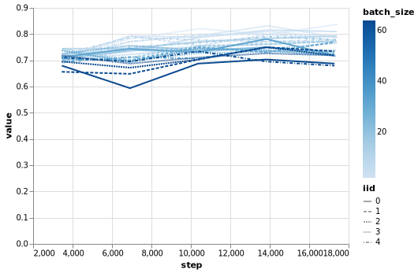

BERT fine-tuning experiments
============================

``` {.python .numberLines startFrom="1"}
import altair as alt
import pandas as pd
import numpy as np
from bert_finetune_experiment import *
from stagedml.stages.all import *
```

Batch size in BERT-\>MRPC fine-tuning
-------------------------------------

The source code of the experiment:

``` {.python .numberLines startFrom="1"}
experiment_bs()->dict:
  result={}
  n=5
  for bs in [2,8,16,32,64]:
    def _new_config(cfg:dict):
      cfg['train_batch_size']=bs
      cfg['train_epoches']=5
      return mkconfig(cfg)
    result[bs]=realizeMany(instantiate(
      redefine(all_minibert_finetune_glue, new_config=_new_config,
                                           new_matcher=match_some(n)),
      num_instances=n))
  return result
```

In the above code we fine-tune BERT-mini model on MRPC task. We increase
the number of epoch to 5 from the default 3, also we want to train
`num_instances=5` models of every batch\_size at once (Actually, current
implementation trains them one-by-one, we could parallelize this in
future). By using `match_some(5)` matcher we are saying that we want at
least 5 realizations of every configuration. Now we execute the
experiment.

``` {.python .numberLines startFrom="6"}
rrefs:Dict[int,List[RRef]]=experiment_bs()
```

Here is the code to process results. First, we building a collection of
`DataFrame`s.

``` {.python .numberLines startFrom="7"}
results=defaultdict(list)
for bs,rrefs in rrefs.items():
  for i,rref in enumerate(rrefs):
    for subf,metric in [('valid','accuracy'),('valid','loss')]:
      es=tensorboard_tensor_events(rref,subf,metric)
      results[f'{subf}-{metric}'].append(
        pd.DataFrame({'step':[e.step*bs for e in es],
                      'value':[te2float(e) for e in es],
                      'batch_size':[bs for _ in es],
                      'iid':[i for _ in es]}))
```

Finally, we print the validation accuracy of our models. Here:

-   `iid` is the instance identifier of the model.
-   `batch_size` is the batch size used during fine-tuning
-   `step` is the number of sentences passed through the model.
    According to the value of `max_seq_length` parameter, each sentence
    contains maximum 128 tokens.

``` {.python .numberLines startFrom="17"}
metric='valid-accuracy'
dflist=results[metric]
df=pd.concat(dflist)
chart=alt.Chart(df).mark_line().encode(
  x='step', y='value', color='batch_size',
  strokeDash='iid')
altair_print(chart, f'figure_{metric}.png')
```



``` {.stderr}
WARN StrokeDash channel should be used with only discrete data.
WARN Using discrete channel "strokeDash" to encode "quantitative" field can be misleading as it does not encode magnitude.
```

-   TODO: find out why do models with smaller batch sizes train better?
    -   Is it the effect of batch-normalization?
    -   Is it the effect of un-disabled dropout?
