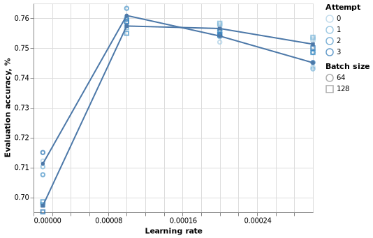
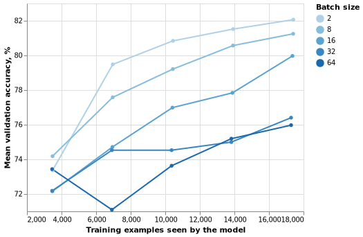

# BERT fine-tuning experiments

In this report we show various aspects of BERT fine-tuning on GLUE
dataset using [StagedML](https://github.com/stagedml/stagedml)
domain-specific language. This document is a literate Python program
rendered with the CodeBraid processor.

``` python numberLines
from bert_finetune_experiment import *
import altair as alt
import pandas as pd
```

  - [Top](/run/bert_finetune)
  - [Python utilities for this report](../bert_finetune_experiment.py).
  - [Source of this report](../Report.md.in).

## Contents

1.  [References](#references)
2.  [Fine-tuning on GLUE tasks](#fine-tuning-on-glue-tasks)
3.  [Batch size VS Learning rate in MNLI-m
    task](#batch-size-vs-learning-rate-in-mnli-m-task)
4.  [Batch size in BERT-\>MRPC
    fine-tuning](#batch-size-in-bert-mrpc-fine-tuning)

## References

  - [Reddit discussion about batch size and learning
    rate](https://www.reddit.com/r/MachineLearning/comments/84waz4/d_relation_between_learning_rate_batch_size_and/)
  - Smith et al. [A Bayesian Perspective on Generalization and
    Stochastic Gradient Descent](https://arxiv.org/abs/1710.06451)
  - MacKay, [A practical Bayesian framework for backpropagation
    networks](https://authors.library.caltech.edu/13793/)
  - Tishby et al. [Consistent inference of probabilities in layered
    networks: predictions and
    generalizations](https://ieeexplore.ieee.org/document/118274)

## Fine-tuning on GLUE tasks

In this section we fine-tune BERT-mini model on most of GLUE tasks in a
loop. For some tasks, we amend the batch size. We also amend values of
`batch_size` and epoches for some tasks.

### Definitions

``` python numberLines
def experiment_allglue(n:int=1)->Dict[str,List[RRef]]:
  result_allglue={}
  for task_name in [t for t in glue_tasks() if t.upper() not in ['COLA']]:
    print(f"Fine-tuning {task_name}")
    batch_size={'MNLI-M':64,
                'MNLI-MM':64,
                'SNLI':64}.get(task_name.upper(),8)
    def _nc(c:dict):
      mklens(c).train_batch_size.val=batch_size
      mklens(c).train_epoches.val=4
    stage=redefine(
      stage=partial(all_minibert_finetune_glue,
                    task_name=task_name, num_instances=n),
      new_config=_nc,
      new_matcher=match_some(n))
    rrefs=realizeMany(instantiate(stage))
    linkrrefs(rrefs, ['bert_finetune',f'allglue-{task_name}'])
    result_allglue[task_name]=rrefs
  return result_allglue
```


  - We loop over all GLUE tasks excluding COLA (TODO: remember why do we
    exclude COLA?)
  - For every task, we realize minibert model
      - `realizeMany(instantiate(...))` is the generic procedure of
        realizing Pylightnix stages
      - `redefine(..)` allows us re-define stage’s configuration
        in-place. In our case we adjust parameters to match the upstream
        settings (set `batch_size`, 4 epoch)
      - Note, that we don’t evaluate all possible parameters like the
        upstream did due to time/hardware constraints.
      - `all_minibert_finetune_glue` is defined in
        `stagedml.stages.all`. By realizing it we also realize all it’s
        dependencies, which includes fetching the required checkpoints
        and datasets.
  - We build a dictionary containing `RRef` realization reference for
    every task.
  - We also display a graph of stages to be realized in order to realize
    the top-level stage of
    `all_minibert_finetune_glue(task_name='QQP')`:
  - The URL of pre-trained model image:
    <https://storage.googleapis.com/bert_models/2020_02_20/uncased_L-4_H-256_A-4.zip>

### Results

``` python numberLines
results=experiment_allglue()
```

``` python numberLines
t=BeautifulTable(max_width=1000)
t.set_style(BeautifulTable.STYLE_MARKDOWN)
t.width_exceed_policy = BeautifulTable.WEP_ELLIPSIS
t.column_headers=['Name']+list(results.keys())
t.append_row(['Accuracy, %']+[
  100*protocol_rref_metric(results[tn][0],'evaluate','eval_accuracy')
    for tn in results.keys()])
t.append_row(['F1_score*100']+[
  100*protocol_rref_metric(results[tn][0],'evaluate','f1_score')
    for tn in results.keys()])
t.append_row(['Tr.time, min']+[f"{store_buildelta(rrefs[0])/60:.1f}"
                                  for rrefs in list(results.values())])
print(t)
```

| Name           | SST-2  | MRPC   | QQP    | MNLI-m | MNLI-mm | SNLI   | QNLI   | RTE    | WNLI   |
| -------------- | ------ | ------ | ------ | ------ | ------- | ------ | ------ | ------ | ------ |
| Accuracy, %    | 86.458 | 76.0   | 87.53  | 72.747 | 74.084  | 84.837 | 84.256 | 60.294 | 39.062 |
| F1\_score\*100 | 54.075 | 75.743 | 43.735 | 42.151 | 42.419  | 40.626 | 53.286 | 40.067 | 34.043 |
| Tr.time, min   | 14.0   | 0.9    | 74.2   | 34.4   | 34.2    | 47.6   | 21.4   | 0.7    | 0.3    |

Where:

  - `Tr.time` shows training time in seconds, training was done on a
    single NVidia 1080Ti GPU.
  - See also [reference results by Google
    Research](https://github.com/google-research/bert#bert).

## Batch size VS Learning rate in MNLI-m task

In this experiment we measure model accuracy for different batch sizes
in learning rates. Learning rate here is the initial learning rate of
Polynomial decay governor, which became active after linear Warmup. The
warmup length is taken to be 10% of the number of training examples
exposed to the model.

### Definitions

``` python numberLines
def experiment_lr(ninst:int=4,
                  task_name:str=DEF_TASK_NAME,
                  batch_sizes:List[int]=DEF_BATCH_SIZES,
                  learning_rates:List[float]=DEF_LEARNING_RATES,
                  )->Dict[Tuple[int,float],List[RRef]]:
  exclude:List[str]=[]
  result_lr={}
  for bs in batch_sizes:
    for lr in learning_rates:
      def _new_config(c:dict):
        mklens(c).train_batch_size.val=bs
        mklens(c).lr.val=lr
        mklens(c).train_epoches.val=5
        mklens(c).flags.val=[f for f in c['flags'] if f not in exclude]
      stage=redefine(
        stage=partial(all_minibert_finetune_glue,
                      task_name=task_name, num_instances=ninst),
        new_config=_new_config,
        new_matcher=match_some(ninst))
      rrefs=realizeMany(instantiate(stage))
      linkrrefs(rrefs,['bert_finetune',f'lr_{task_name}_{bs}_{lr}'])
      result_lr[(bs,lr)]=rrefs
  return result_lr
```

  - We train several instances of BERT-mini model on the MNLI-m task.
  - Batch sizes: \[64, 128\]
  - Peak learning rates: \[1e-05, 0.0001, 0.0002, 0.0003\]
  - For every `batch size` + `learning rate` combination, we do 4
    training attempts with different random
initialization.

### Results

``` python numberLines
results=experiment_lr()
```

``` python numberLines
cols={'batch_size':[], 'learning_rate':[], 'eval_accuracy':[], 'attempt':[]}
for (bs,lr),rrefs in results.items():
  for iid,rref in enumerate(rrefs):
    es=tensorboard_tensors(rref,'eval','eval_accuracy')
    cols['eval_accuracy'].extend([te2float(e) for e in es])
    cols['learning_rate'].extend([lr for _ in es])
    cols['batch_size'].extend([bs for _ in es])
    cols['attempt'].extend([iid for _ in es])

df=pd.DataFrame(cols)
chart1=alt.Chart(df).mark_point().encode(
  x='learning_rate',
  y=alt.Y('eval_accuracy', title='Evaluation accuracy, %',
                            scale=alt.Scale(zero=False)),
  shape='batch_size:O',
  color=alt.Color('attempt:O', title='Attempt'))

chart=chart1
for bs in DEF_BATCH_SIZES:
  df2=df[df['batch_size']==bs].drop('attempt',1).groupby('learning_rate',as_index=False).mean()
  chart2=alt.Chart(df2).mark_line().encode(
    x=alt.X('learning_rate', title='Learning rate'),
    y=alt.Y('eval_accuracy', title='Evaluation accuracy, %',
                              scale=alt.Scale(zero=False)),
    shape=alt.Shape('batch_size:O', title='Batch size'))
  chart+=chart2

altair_print(chart, f'figure_eval_accuracy_lr.png')
```



``` stderr
WARN Using discrete channel "shape" to encode "ordinal" field can be misleading as it does not encode order.
WARN Using discrete channel "shape" to encode "ordinal" field can be misleading as it does not encode order.
WARN Using discrete channel "shape" to encode "ordinal" field can be misleading as it does not encode order.
```

  - We see best accuracy on smaller batch sizes with smaller learning
    rates.
  - Increasing batch size may require increasing of learning rate as
    well.
  - Results are qualitatively consistent with the conclusions of [Smith
    et al. paper](https://arxiv.org/abs/1710.06451)
  - For `batch_size=64`, best accuracy was achieved with
    `learning_rate=1e-4`
  - For `batch_size=128`, best accuracy was achieved somewhere between
    `learning_rate=1e-4` and `learning_rate=2e-4`

## Batch size in BERT-\>MRPC fine-tuning

In this section we study how does `batch_size` affect final accuracy of
the model.

### Definitions

``` python numberLines
def experiment_bs(n:int=4, exclude=[])->Dict[int,List[RRef]]:
  result_bs={}
  for bs in [2,8,16,32,64]:
    def _new_config(c:dict):
      mklens(c).train_batch_size.val=bs
      mklens(c).train_epoches.val=5
      mklens(c).flags.val=[f for f in c['flags'] if f not in exclude]
    result_bs[bs]=realizeMany(instantiate(
      redefine(all_minibert_finetune_glue, new_config=_new_config,
                                           new_matcher=match_some(n)),
      num_instances=n))
  return result_bs
```

  - We loop over certain batch\_sizes and evaluate BERT-mini fine-tuning
    procedure. List of important APIs includes:
      - `realizeMany(instance(..))` runs generice two-pass stage
        realization mechanism of Pylightnix.
      - `redefine(..)` tweaks stage configuration before the
        realization. Besides setting batch\_size, we increase number of
        epoches up to 5.
      - `all_minibert_finetune_glue` is one of StagedML stages, defined
        in `stagedml.stages.all`. By realizing it we also realize all
        it’s dependencies, which includes fetching the required images
        and datasets from the Internet.
  - `num_instances` parameter of `all_minibert_finetune_glue` stage sets
    the desired number of model instances sharing the same
    configuration.
  - We collect results in a dictionary which maps `batch_sizes` to
    corresponding realization references.

### Results

``` python numberLines
results=experiment_bs()
```

``` python numberLines
cols={'eval_accuracy':[], 'batch_size':[], 'attempt':[]}
for bs,rrefs in results.items():
  for attempt,rref in enumerate(rrefs):
    es=tensorboard_tensors(rref, 'eval', 'eval_accuracy')
    cols['eval_accuracy'].extend([100.0*te2float(e) for e in es])
    cols['batch_size'].extend([bs for _ in es])
    cols['attempt'].extend([attempt for _ in es])

chartP=alt.Chart(pd.DataFrame(cols)).mark_point().encode(
  x=alt.X('batch_size', title='Batch size'),
  y=alt.Y('eval_accuracy', title='Evaluation accuracy, %',
                           scale=alt.Scale(zero=False)),
  color=alt.Color('attempt:O', title='Attempt'))
chartM=alt.Chart(pd.DataFrame(cols)).mark_line().encode(
  x=alt.X('batch_size', title='Batch size'),
  y=alt.Y('eval_accuracy', title='Evaluation accuracy, %',
                           aggregate='mean',
                           scale=alt.Scale(zero=False)))
altair_print(chartP+chartM, f'figure_eval_accuracy.png')
```


``` python numberLines
cols={'nexamples':[], 'valid_accuracy':[], 'batch_size':[], 'attempt':[]}
for bs,rrefs in results.items():
  for attempt,rref in enumerate(rrefs):
    es=tensorboard_tensors(rref,'valid','accuracy')
    cols['nexamples'].extend([e.step*bs for e in es])
    cols['valid_accuracy'].extend([100.0*te2float(e) for e in es])
    cols['batch_size'].extend([bs for _ in es])
    cols['attempt'].extend([attempt for _ in es])
chart=alt.Chart(pd.DataFrame(cols)).mark_line(point=True).encode(
  x=alt.X('nexamples', title='Training examples seen by the model'),
  y=alt.Y('mean(valid_accuracy)', title='Mean validation accuracy, %',
                                  scale=alt.Scale(zero=False)),
  color=alt.Color('batch_size:O', title='Batch size')
  )
altair_print(chart, f'figure_valid_accuracy.png')
```



  - `tensorboard_tensors` is a helper method to access stages
    TensorBoard journals stored in realization’s folder.
  - `attempt` is the identifier of the training attempt. For any given
    `batch_size`, attempts differ only with the initial values of
    classification head of the model.
  - `batch_size` is the batch size used during fine-tuning
  - `steps` is the number of sentences passed through the model.
    According to the value of `max_seq_length` parameter, each sentence
    contains maximum 128 tokens.
  - TODO: find out why do models with smaller batch sizes train better?
      - Is it the effect of batch-normalization (if any)?
      - Is it the effect of dropout not disabled?
