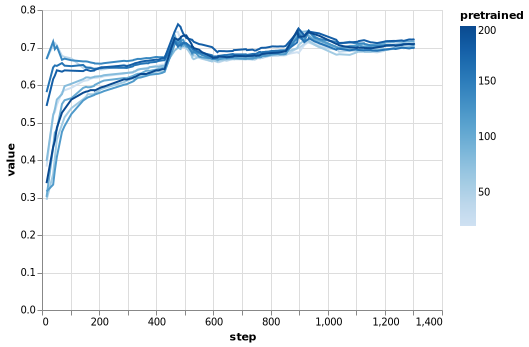
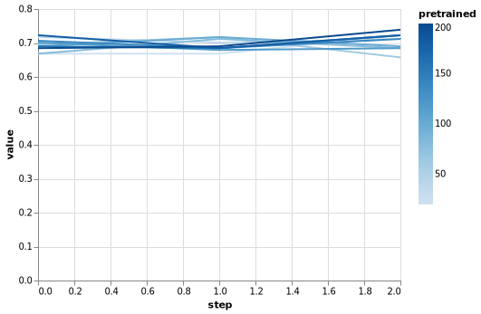

Test summary on BERT pre-training
---------------------------------

TODO: intro

``` {.python .numberLines startFrom="1"}
import altair as alt
import pandas as pd
import numpy as np
from bert_pretrain_experiment import *
from stagedml.stages.all import *
```

The source code of the main training function is as follows:

``` {.html .numberLines startFrom="1"}
run_bert_pretrain(task_name:str='MRPC', epoches:int=200, epoches_step:int=20
                     )->Tuple[Dict[int,RRef],Dict[int,RRef]]:
  """ Run the pre-training of BERT-mini models for a number of `epoches`. Make
  fine-tuning after every `epoches_step` epoch on the `task_name` GLUE task,
  collect the results. Return the dictionaries of all models. """

  def _pretrain_stage(nepoch:int, resume_rref:Optional[RRef])->Stage:
    def _stage(m)->BertCP:
      return all_minibert_pretrain(m, train_epoches=nepoch, resume_rref=resume_rref)
    return _stage

  def _finetune_stage(nepoch:int)->Stage:
    def _stage(m)->BertGlue:
      refglue=all_fetchglue(m)
      refbert=_pretrain_stage(nepoch, None)(m)
      gluetfr=glue_tfrecords(m, task_name,
          bert_vocab=mklens(refbert).bert_vocab.refpath,
          refdataset=refglue)
      tfbert=bert_finetune_glue(m,refbert,gluetfr)
      return tfbert
    return _stage

  pretrained:Dict[int,RRef]={}
  finetuned:Dict[int,RRef]={}
  for e in range(epoches_step,epoches+epoches_step,epoches_step):
    out=Path(join(STAGEDML_EXPERIMENTS,'bert_pretrain',f'epoch-{e}'))
    makedirs(out, exist_ok=True)
    pretrained[e]=\
        realize(instantiate(_pretrain_stage(e, pretrained.get(e-epoches_step))))
    linkrref(pretrained[e],out)
    finetuned[e]=realize(instantiate(_finetune_stage(e)))
    linkrref(finetuned[e],out)
  return pretrained,finetuned
```

We now run the experiment. We assume that Pylightnix already has the
results in it's storage because otherwize the report generation would
take too long to complete.

``` {.python .numberLines startFrom="6"}
pretrained,finetuned=run_bert_pretrain()
```

TODO: results

``` {.python .numberLines startFrom="7"}

results=defaultdict(list)
for epoch,rref in finetuned.items():
  for subf,metric in zip(['validation','train'],
                         ['epoch_accuracy','batch_accuracy']):
    es=tensorboard_scalar_events(
        rref,subf,metric)
    results[metric].append(
      pd.DataFrame({'step':[e.step for e in es],
                    'value':[e.value for e in es],
                    'pretrained':[epoch for _ in es]}))
```

TODO: Describe train batch accuracy

``` {.python .numberLines startFrom="18"}
metric='batch_accuracy'
dflist=results[metric]
df=pd.concat(dflist)
chart=alt.Chart(df).mark_line().encode(
  x='step', y='value', color='pretrained')
altair_print(chart, f'figure_{metric}.png')
```



TODO: Describe evaluation epoch accuracy

``` {.python .numberLines startFrom="24"}
metric='epoch_accuracy'
dflist=results[metric]
df=pd.concat(dflist)
chart=alt.Chart(df).mark_line().encode(
  x='step', y='value', color='pretrained')
altair_print(chart, f'figure_{metric}.png')
```


