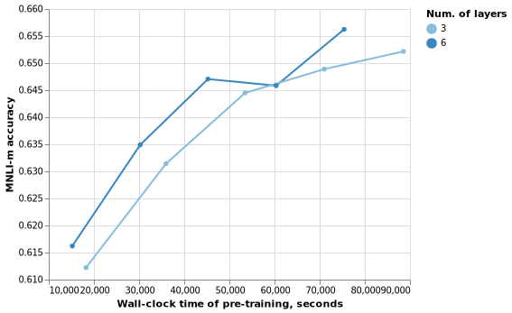

# BERT pre-training

This project aims at reproducing results of the following papers:

1.  [BERT Pre-training](https://arxiv.org/pdf/1810.04805.pdf) by Google
    Research.
2.  [Train Large, Then Compress: Rethinking Model Size for Efficient
    Training and Inference of
    Transformers](https://arxiv.org/abs/2002.11794) by Zhuohan Li et al.

<!-- end list -->

  - The current implementation is based on the
    [StagedML](https://github.com/stagedml/stagedml) framework. We
    extensively use it’s Python-based domain-specific language and
    terminology.
  - [Bert-pretrain project](/run/bert_pretrain) is located in the
    StagedML repository.
  - [bert\_pretrain\_experiment.py](../bert_pretrain_experiment.py)
    defines utility stages and procedures required by this experiment.
  - This document is a literate Python program rendered with the
    CodeBraid processor.

<!-- end list -->

``` python numberLines
from stagedml.stages.all import *
from bert_pretrain_experiment import *
import altair as alt
```

## Contents

1.  [References](#references)
2.  [Dataset](#dataset)
3.  [Pre-training](#pre-training)
4.  [Conclusions](#conclusions)
5.  [Appendix A: Number of pre-training
    epoches](#appendix-a-number-of-pre-training-epoches)
6.  [Appendix B: Pre-training
    algorithm](#appendix-b-pre-training-algorithm)
7.  [Appendix C: Reproducing the
    experiment](#appendix-c-reproducing-the-experiment)

## References

1.  BERT materials
      - Paper <https://arxiv.org/pdf/1810.04805.pdf>
      - GitHub <https://github.com/google-research/bert>
      - DataScienceToday publication
        <https://datasciencetoday.net/index.php/en-us/nlp/211-paper-dissected-bert-pre-training-of-deep-bidirectional-transformers-for-language-understanding-explained>
      - GoogleResearch Issue \#570
        <https://github.com/google-research/bert/issues/570>
      - GoogleResearch Issue \#1025
        <https://github.com/google-research/bert/issues/1025>
2.  Zhuohan Li et al. Train Large, Then Compress: Rethinking Model Size
    for Efficient Training and Inference of Transformers
      - Paper <https://arxiv.org/abs/2002.11794>
      - Berkeley publication
        <https://bair.berkeley.edu/blog/2020/03/05/compress/>
3.  RoBERTa: A Robustly Optimized BERT Pretraining Approach
      - Paper <https://arxiv.org/abs/1907.11692>
4.  Hardware utilization metrics in TensorFlow
      - StackOverflow question \#40190510
        <https://stackoverflow.com/questions/40190510/tensorflow-how-to-log-gpu-memory-vram-utilization>
      - TensorFlow documentation
        <https://www.tensorflow.org/guide/gpu#limiting_gpu_memory_growth>

## Datasets

We use either English or Russian Wikipedia corpus for pre-training.
Pre-processing includes fetching the dump and converting it into
TensorFlow records format by the TF OfficialModel’s algorithm. The main
parameters of the datasets are shown in the table below:

``` python numberLines
t=BeautifulTable(max_width=1000)
t.set_style(BeautifulTable.STYLE_MARKDOWN)
t.width_exceed_policy=BeautifulTable.WEP_ELLIPSIS
t.column_headers=['Dataset', 'Link',
                  'Number of Documnets, M', 'Number of words, Bn',
                  'Dupe factor', 'Approx. Number of examples, M']
t.numeric_precision=2
for nm,ds in [('English Wikipedia',dataset_en), ('Russian Wikipedia', dataset_ru)]:
  url=mklens(instantiate(ds).dref).wikiref.wikiref.url.val
  t.append_row([
    nm,
    markdown_url(url, descr=url.split('/')[-1]),
    num_documents_(ds)/10**6, num_words_(ds)/10**9,
    mklens(instantiate(ds).dref).dupe_factor.val,
    num_tfrecords_approx_(ds)/10**6
    ])
print(t)
```

| Dataset           | Link                                                                                                                         | Number of Documnets, M | Number of words, Bn | Dupe factor | Approx. Number of examples, M |
| ----------------- | ---------------------------------------------------------------------------------------------------------------------------- | ---------------------- | ------------------- | ----------- | ----------------------------- |
| English Wikipedia | [enwiki-20200301-pages-articles.xml.bz2](https://dumps.wikimedia.org/enwiki/20200301/enwiki-20200301-pages-articles.xml.bz2) | 5.89                   | 2.17                | 2           | 51.7                          |
| Russian Wikipedia | [ruwiki-20200301-pages-articles.xml.bz2](https://dumps.wikimedia.org/ruwiki/20200301/ruwiki-20200301-pages-articles.xml.bz2) | 1.6                    | 0.45                | 10          | 78.2                          |

  - WordPiece vocabulry is taken from Multilingual BERT by
    GoogleResearch.
  - `Dupe_factor` is a rate of duplication used in TFRecord generation
    algorithm
  - For reference, Zhuohan Li et al. reported about 3.4 Bn words for
    English Wikipedia. The difference with our counting could be due to
    different extraction algorithms.

## Pre-training

We pretrain 6-layer BERT model on English wikipedia corpus described
above. We count 1 epoch equal to 10K gradient steps. Total pre-training
duration is 1M steps which is 100 epoches.

  - 6-layer BERT model was measured to require the 4375 Mb of GPU memory
    and 1721 Mb of Host memory on `batch_size` of 64. We also tried to
    increase the batch\_size and monitor how does memory requirement
    change. Model with `batch_size=75` fits in the same memory, but
    setting `batch_size=85` caused GPU memory requirement to double.
  - 3-layer BERT fits in the 4375 Mb of GPU memory with
    `batch_size=128`, but doesn’t fit if `batch_size` is 140. So we set
    `batch_size` to 128.

We pre-train the following
models:

| Model alias               | Number of Layers | Hidden layer size | Batch size | Steps per epoch | Ref.epoches |
| ------------------------- | ---------------- | ----------------- | ---------- | --------------- | ----------- |
| minibert-pretrain-wiki-3L | 3                | 256               | 128        | 10000           | 800.0       |
| minibert-pretrain-wiki-6L | 6                | 256               | 64         | 10000           | 1600.0      |

  - `Ref.Epoched` column contains the number of epoches required to
    match the reference model from BERT paper in the number of parameter
    updates. [Appendix A](#appendix-a-number-of-pre-training-epoches)
    shows the procedure of it’s calculation.
  - [Appendix B](#appendix-b-pre-training-algorithm) lists the code of
    the main training routine.
      - We pre-train each of the above models on a single Wikipedia
        corpus for limited number of epoches.
      - After each 10 epoches we perform fine-tuneing on the GLUE task
        MNLI-m.
      - Due to time/hardware limitations, we pre-train only first 500000
        steps, divided into 50 epoches.
      - We measure wall-clock time during pre-training (not including
        fine-tuning) and the fine-tuning accuracy. Results are shown
        below.
      - Training was done on a single NVidia 1080Ti GPU card.

<!-- end list -->

``` python numberLines
data={'epoches':[], 'accuracy':[], 'layers':[], 'wallclock':[]}
for stage in [model_6(), model_3()]:
  pretrained,finetuned=experiment_pretrain(stage, dataset_en)
  for npepoch,rref in finetuned.items():
    nL=mklens(rref).refbert.bert_config_template.num_hidden_layers.val
    wc=float(readstr(mklens(pretrained[npepoch]).traintime.syspath))
    for folder,metric in [('eval','eval_accuracy')]:
      es=tensorboard_tensors(rref,folder,metric)
      data['epoches'].extend([npepoch for e in es])
      data['accuracy'].extend([te2float(e) for e in es])
      data['layers'].extend([int(nL) for _ in es])
      data['wallclock'].extend([wc for _ in es])
```

``` python numberLines
chart=alt.Chart(DataFrame(data)).mark_line(point=True).encode(
  x=alt.X('wallclock', title='Wall-clock time of pre-training, seconds'),
  y=alt.Y('accuracy',scale=alt.Scale(zero=False),
    title=f'{DEF_FINETUNE_TASK} accuracy'),
  color=alt.Color('layers:O', title='Num. of layers'))
print(markdown_altair(chart, 'wallclock_accuracy.png'))
```



  - On the above plot we show fine-tuning accuracies of each of two
    models.
  - The exact moments of fine-tuning are shown as bold dots. Fine-tuning
    happens every 100000 steps.
  - One step of the smaller model takes more time than one step of the
    bigger model. It should be a result of `batch_size` of smaller model
    is twice as big as `batch_size` of bigger model.
  - We see that 6-layer model reached the given accuracy faster than
    3-layer model almost every time.

## Conclusions

1.  We were able to reproduce the results of Zhuohan Li et al. In our
    experiments, larger model shows better fine-tuning accuracy than
    smaller model most of the time.
2.  Models were pre-trained only a limited amount of time due to the
    time/hardware limitations.
3.  The BERT pre-training procedure and the Zhuohan Li et al. experiment
    are encoded using Python-based domain specific language of
    StagedML/Pylighnix.

## Appendix A: Number of pre-training epoches

``` python numberLines
def calculate_pretrain_epoches(stage_ds:DatasetStage,
                               train_batch_size:int,
                               train_steps_per_epoch:int=DEF_STEPS_PER_EPOCH)->int:
  """ Calculate the number of epoches required to match the reference model in
  the number of parameter updates.

  Ref. https://arxiv.org/pdf/1810.04805.pdf, section A.2. "Pre-training
  procedure"
  """
  upstream_train_steps=10**6
  upstream_batch_size=256
  upstream_seq_length=512
  upstream_total_tokens=upstream_train_steps * upstream_batch_size * upstream_seq_length

  # Calculate number of training epoches for our model to match the upstream
  our_batch_size=train_batch_size
  our_seq_length=mklens(instantiate(stage_ds).dref).max_seq_length.val
  our_train_steps=upstream_total_tokens / (our_batch_size * our_seq_length)
  out_epoches=our_train_steps // train_steps_per_epoch
  return out_epoches
```

## Appendix B: Pre-training algorithm

``` python numberLines
def model_3()->ModelStage:
  def _nc(c):
    mklens(c).name.val+='-3L'
    mklens(c).bert_config_template.num_hidden_layers.val=3
    mklens(c).train_batch_size.val=128
  return redefine(minibert_pretrain_wiki, new_config=_nc)

def model_6()->ModelStage:
  def _nc(c):
    mklens(c).name.val+='-6L'
    mklens(c).bert_config_template.num_hidden_layers.val=6
    mklens(c).train_batch_size.val=64
  return redefine(minibert_pretrain_wiki, new_config=_nc)
```

``` python numberLines
def experiment_pretrain(model:ModelStage,
                        ds:DatasetStage,
                        nepoches:int=DEF_NEPOCHES,
                        train_steps_per_epoch:int=DEF_STEPS_PER_EPOCH,
                        epoches_step:int=DEF_EPOCHES_BETWEEN_FINETUNES,
                        finetune_task_name:str=DEF_FINETUNE_TASK,
                        )->Tuple[dict,dict]:
  """ Pretrain BERT for `train_steps_per_epoch*nepoches` steps on `ds` corups.
  Pause every `epoches_step` epoches to make a fine-tuning on the GLUE task of
  `finetune_task_name`. Return a tuple of dicts, mapping number of pre-trained
  epoches to fine-tuning realization references.
  """
  assert finetune_task_name in glue_tasks()

  def _pretrain_stage(nepoch:int, resume_rref:Optional[RRef])->Stage:
    def _stage(m):
      return model(m,
        tfrecs=ds(m),
        train_steps_per_epoch=train_steps_per_epoch,
        train_epoches=nepoch,
        resume_rref=resume_rref)
    return _stage

  def _finetune_stage(nepoch:int)->Stage:
    def _stage(m)->BertGlue:
      refglue=all_fetchglue(m)
      refbert=_pretrain_stage(nepoch, None)(m)
      gluetfr=glue_tfrecords(m,
        finetune_task_name,
        bert_vocab=mklens(refbert).bert_vocab.refpath,
        lower_case=(mklens(refbert).cased.val==False),
        refdataset=refglue)
      tfbert=bert_finetune_glue(m,refbert,gluetfr)
      return tfbert
    return _stage

  pretrained:Dict[int,RRef]={}
  finetuned:Dict[int,RRef]={}
  for e in range(epoches_step,nepoches+epoches_step,epoches_step):
    print(f"Pre-training up to {e}/{nepoches}")
    pretrained[e]=realize(instantiate(
      _pretrain_stage(e, pretrained.get(e-epoches_step))))
    linkrref(pretrained[e],['bert_pretrain',f'epoch-{e}'], verbose=True)
    print(f"Fine-tunining after {e}-epoch pre-training")
    finetuned[e]=realize(instantiate(_finetune_stage(e)))
    linkrref(finetuned[e],['bert_pretrain',f'epoch-{e}'], verbose=True)
  return pretrained,finetuned
```

  - We use StagedML/Pylightnix API to encode the experiment.
  - `_pretrain_stage` and `_finetune_stage` define final stages of
    pre-training and fine-tuning. They depend on a number of
    intermediate stages defined in the [StagedML
    collection](https://github.com/stagedml/stagedml/blob/master/src/stagedml/stages/all.py).
  - Names of standard stages typically begin with `all_` prefix.
  - The most important stage of pre-training BERT is
    `minibert_pretrain_wiki` defined in [bert\_pretrain\_wiki.py of
    StagedML](https://github.com/stagedml/stagedml/blob/master/src/stagedml/stages/bert_pretrain_wiki.py)
  - Stages depend on each other by storing ‘derivation references’ or
    `refpaths`.
  - `mklens` are the main top-level method of accessing stage’s
    parameters and navigating though the dependencies. Internally, it is
    reduced to accessing immutable `config.json` dictionary of every
    stage.
  - Stage realizations are stored in the Pylightnix storage in the
    filesystem. Existing realizations are re-used at subsequent runs of
    the function. Code inside `_stage's` should be treated as
    declaration of dependencies rather than imperative instructions.

## Appendix C: Reproducing the experiment

To run the described experiment, one typically need to follow [StagedML
user-track installation
steps](https://github.com/stagedml/stagedml/blob/master/README.md#install-user-track).
As a result, you see the shell of the Docker container which contains
required dependencies. In this shell, change directory to the
`~/run/bert_pretrain` folder and type

``` sh
$ make train
```

Training may take up to 3 days on weak hardware and `~100Gb` of disk
space to store the datasets. When training is complete, type:

``` sh
$ make md
```

to produce markdown report or `make html` to produce HTML version of the
report. Results will be available in `out` and `out_html` folders
correspondingly.
