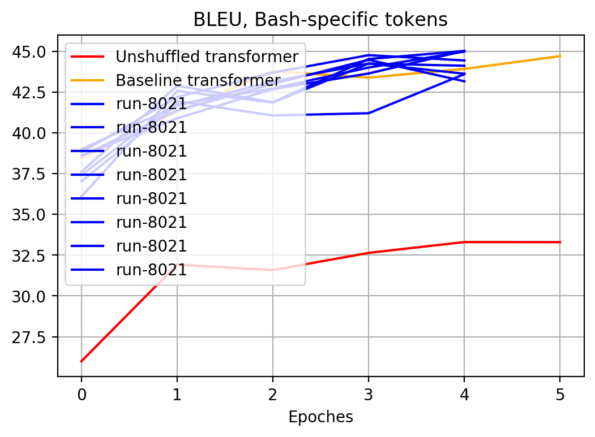
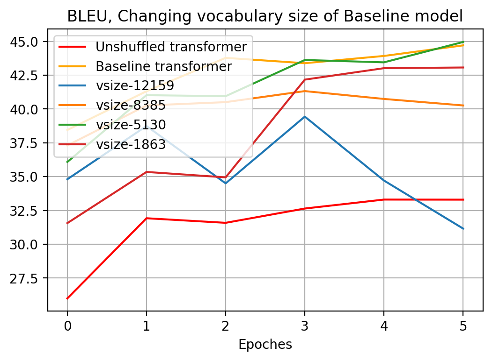

NL2Bash Transformer
===================

This document describes the results of training [TensorFlow official
Trnasformer][1] on the [NL2Bash][5] dataset introduced by Xi Victoria Lin
et al. in their paper [Nl2Bash: Corpus and Semantic Parser for Natural Language
Interface to the Linux Operating System][2]. We use [StagedML][3] library to
generate this report.

The primary goal of this work is to demonstrate the features of [StagedML][3]
library which was used to run experiments and generate this report. The
secondary goal is to evaluate the NL2BASH dataset on the stock transformer
model.

* [Source code of this report](../Report.md.in). We use
  [PWeave](http://mpastell.com/pweave) to render this report.
* [Combined python code used in the report](Report.py)


```python
import numpy as np
import matplotlib.pyplot as plt

from shutil import copyfile
from itertools import islice
from pylightnix import (
    RRef, Path, realize, instantiate, redefine, mkconfig, promise, rref2dref,
    mksymlink, rref2path, mklens, match_best )
from stagedml.imports import ( environ, join, environ, makedirs )
from stagedml.stages.all import ( transformer_wmt, all_nl2bashsubtok,
    all_fetchnl2bash )
from analyze import ( read_tensorflow_log,  vocab_size, model_size )
```


Contents
--------

1. [Definitions](#definitions)
    * [Model](#model)
    * [Metrics](#metrics)
    * [Dataset](#dataset)
2. [Experiments](#experiments)
    * [Baseline model](#baseline-transformer) Run the Transformer with default
       settings.
    * [Unshuffled](#unshuffled-transformer) Occasional experiment where we passed
      unshuffled dataset to the baseline model
    * [Bashtokens](#bash-specific-tokens) In this runs we pre-parse the training
      dataset and force tokenizer to issue bash-specific subtokens which include
      commands and flags names.
    * [Baseline+vocab_sizes](#changing-vocabulary-size-of-baseline-model) We try
      different target vocabulary sizes of the baseline vocabulary
    * [Bashtoken+vocab_sizes](#changing-vocabulary-size-of-bashtoken-model) We try
      different target vocabulary sizes of the Bashtoken model
    * [Bashtoken+1punct](#single-char-punctuation-tokens) We suppress
      multicharacter punktuation subtokens.
3. [Conclusions](#conclusion)


Definitions
-----------

### Model

In this work, we train a copy of TensorFlow Official Transformer model.
This model is intended for machine translation task. Typical use case is EN-DE
translation. The model uses shared vocabulary of subtokens for both input and
target languages. In this work we pretend that Bash is the target language of
the model.

The model is defined in TensorFlow Keras API and is located in the
[transformer_wmt.py](/src/stagedml/stages/transformer_wmt.py). In this file we
define the following entities:

 - `TransformerBuild` class for storing the mutable state of the model
 - Set of operations, which includes `build`, `train`, `evaluate` and `predict`
   operations. Operations tupically accept the mutable state and do the named
   modification: `build` builds the Keras model, `train` trains it, and so on.
 - `transformer_wmt` functions wraps the above actions into Pylightnix entity
   called _Stage_. The stage function is an "entry point" of the whole module.
   It takes the following stage-level arguments:
    * `m` is a technical argument representing Pylightnix dependency resolution context.
    * `wmt:WmtSubtok` is a reference to the upstream stage which provides access to
      the database and to Subtokenizer.
    * `num_instances:int=1` is the number of model instances to train. Setting this
      argument to value greater than one will result in training several independent
      instances of the model which shares the configuration.

   Stage function returns the _Derivation reference_ handler which could be used in
   downstream stages. Typically, we pass stage functions to
   `realizeMany(instantiate(.))` functions of Pylightnix API. The result of such
   calls is a list of _Realization references_ which may be used to directly access
   the instance artifacts.

`transformer_wmt` defines rather generic version of Transformer which has no
NL2Bash-specific settings. We change some of it's configuration parameters in
top-level code snippets before running every experiment. Top-level code of the
baseline model looks like the following:


```python
from pylightnix import ( RRef, realizeMany, instantiate, redefine, mkconfig,
    mksymlink, match_some )
from stagedml.stages.all import transformer_wmt, all_nl2bashsubtok

def baseline_subtok(m):
  return all_nl2bashsubtok(m, shuffle=True,
                              with_bash_charset=False,
                              with_bash_subtokens=False)

def baseline_transformer(m):
  def _config(c):
    c['train_steps']=6*5000
    c['params']['beam_size']=3 # As in Tellina paper
    return mkconfig(c)
  return redefine(transformer_wmt,
                  new_config=_config,
                  new_matcher=match_some())(m, baseline_subtok(m), num_instances=5)
```


* `train_steps` is the total number of batches to train the model. One epoch is
  defined to contain `5000` steps by default.
* The model uses beam_size of `3`.
* The model uses shared vocabulary, it's final size is 5833.
* The number of trainable weights of baseline model is 47090688.

### Metrics

We use BLEU metrics to report the model performance. Bleu implementation is
taken in from official Trnasformer model. This metric may differs from the
version of BLEU which were used by the authors of NL2BASH paper, so we can't
compare results directly.

We applied the metrics to the evaluation subset of the NL2Bash dataset which is
a `0.1` part of the original dataset.

### Dataset

We print top 5 lines of input and target sentences of the [NL2Bash][5] dataset.


```python
rref=realize(instantiate(all_fetchnl2bash))
copyfile(mklens(rref).eval_input_combined.syspath, join(environ['REPORT_OUTPATH'],'eval_input.txt'))
copyfile(mklens(rref).eval_target_combined.syspath, join(environ['REPORT_OUTPATH'],'eval_target.txt'))

with open(mklens(rref).train_input_combined.syspath) as inp, \
     open(mklens(rref).train_target_combined.syspath) as tgt:
  for i, (iline, tline) in islice(enumerate(zip(inp,tgt)),5):
    print(f"#{i}\t[I] {iline.strip()}\n\t[T] {tline.strip()}")
```

```
#0	[I] Pass numbers 1 to 100000 as arguments to "/bin/true"
	[T] /bin/true $(seq 1 100000)
#1	[I] Replace "foo" with "bar" in all PHP files in the current directory tree
	[T] find . -name "*.php" -exec sed -i 's/foo/bar/g' {} \;
#2	[I] Search the entire file hierarchy for files ending in '.old' and delete them.
	[T] find / -name "*.old" -delete
#3	[I] Find all directories under /path/to/Dir and set their permission to 755
	[T] sudo find /path/to/Dir -type d -print0 | xargs -0 sudo chmod 755
#4	[I] run "tar -xzvf ..." as user $username
	[T] su $username -c tar xzvf ..
```


* [Evaluation inputs](./eval_input.txt)
* [Evaluation targets](./eval_target.txt)

Experiments
-----------

### Baseline transformer

We display the BLEU metrics of the baseline model defined above. We train the
model for 6 epoches.


```python
plt.figure(1)
plt.xlabel("Training steps")
plt.title("BLEU-cased, Baseline transformer")

out=join(environ['STAGEDML_ROOT'],'_experiments','nl2bash','baseline')
makedirs(out, exist_ok=True)
summary_baseline_bleu=[]
for i,rref in enumerate(realizeMany(instantiate(baseline_transformer))):
  mksymlink(rref, out, f'run-{i}', withtime=False)
  baseline_bleu=read_tensorflow_log(join(rref2path(rref),'eval'), 'bleu_cased')
  plt.plot(range(len(baseline_bleu)), baseline_bleu, label=f'run-{i}', color='blue')
  summary_baseline_bleu.append((vocab_size(baseline_transformer),baseline_bleu[4]))

plt.legend(loc='upper left', frameon=True)
plt.grid(True)
```

\


In subsequent experiments we plot BLEU of the best instance of baseline
model.


```python
rref=realize(instantiate(redefine(baseline_transformer,new_matcher=match_best('bleu.txt'))))
baseline_bleu=read_tensorflow_log(join(rref2path(rref),'eval'), 'bleu_cased')
```


```python
rref=realize(instantiate(redefine(baseline_transformer,new_matcher=match_best('bleu.txt'))))
copyfile(join(rref2path(rref),'output-5.txt'), join(environ['REPORT_OUTPATH'],'baseline_output.txt'))
```


* [Evaluation inputs](./eval_input.txt)
* [Evaluation targets](./eval_target.txt)
* [Model prediction](./baseline_output.txt)


### Unshuffled dataset

We occasionally trained the model on unshuffled dataset. As we can see,
unshuffled dataset reduces the model's performance significantly.


```python
def unshuffled_subtok(m):
  return all_nl2bashsubtok(m, shuffle=False,
                              with_bash_charset=False,
                              with_bash_subtokens=False)

def unshuffled_transformer(m):
  def _config(c):
    c['train_steps']=6*5000
    c['params']['beam_size']=3 # As in Tellina paper
    return mkconfig(c)
  return redefine(transformer_wmt,_config)(m, unshuffled_subtok(m))
```


\


### Bash-specific tokens

Originally this experiment was intended to run the model with bash-specific
tokens _and_ different vocabulary sizes. Unfortunately, due to subtokenizer API
misuse, we in fact measured the performance on the same target vocabulary. We
will make the corrections in the next experiment and here we display just the
effect of adding bash-specific tokens.

Adding the bash-specifics include:

1. Changing the Master Character Set of the Subtokenizer by adding
   `['-','+',',','.']` to the default list of Alphanumeric characters
2. Pre-parsing the train part of BASH dataset and generating the list of
   reserved subtokens. The list includes:
    - First words of every command. Often those are command names.
    - All words starting from `-`. Often those are flags of bash commands.


```python
def run1(vsize:int)->RRef:

  def mysubtok(m):
    def _config(d):
      d['target_vocab_size']=vsize  # Doesn't in fact depend on this parameter
      d['vocab_file'] = [promise, 'vocab.%d' % vsize]
      return mkconfig(d)
    return redefine(all_nl2bashsubtok, _config)(m,
                    shuffle=True, with_bash_charset=True, with_bash_subtokens=True)

  def mytransformer(m):
    def _config(c):
      c['train_steps']=5*5000
      c['params']['beam_size']=3 # As in Tellina paper
      return mkconfig(c)
    return redefine(transformer_wmt,_config)(m, mysubtok(m))

  return mysubtok, mytransformer
```


Results:


\


### Changing vocabulary size of Baseline model

We set the target size of the subtoken vocabulary to different values in range
`[1000, 15000]`.

Model config:


```python
def run(vsize:int):
  def mysubtok(m):
    def _config(d):
      d['target_vocab_size']=vsize
      d['vocab_file'] = [promise, 'vocab.%d' % vsize]
      d['train_data_min_count']=None
      d['file_byte_limit'] = 1e6 if vsize > 5000 else 1e5
      return mkconfig(d)
    return redefine(all_nl2bashsubtok,_config)(m,
      shuffle=True, with_bash_charset=False, with_bash_subtokens=False)

  def mytransformer(m):
    def _config(c):
      c['train_steps']=6*5000
      c['params']['beam_size']=3 # As in Tellina paper
      return mkconfig(c)
    return redefine(transformer_wmt,_config)(m, mysubtok(m))

  return mysubtok, mytransformer
```


Results:


\


### Changing vocabulary size of Bashtoken model

We set the target size of the subtoken vocabulary to different values in range
`[1000, 15000]`.

Model config:


```python
def run2(vsize:int)->None:
  def mysubtok(m):
    def _config(d):
      d['target_vocab_size']=vsize
      d['vocab_file'] = [promise, 'vocab.%d' % vsize]
      d['train_data_min_count']=None
      d['file_byte_limit'] = 1e6 if vsize > 5000 else 1e5
      return mkconfig(d)
    return redefine(all_nl2bashsubtok,_config)(m,
      shuffle=True, with_bash_charset=True, with_bash_subtokens=True)

  def mytransformer(m):
    def _config(c):
      c['train_steps']=6*5000
      c['params']['beam_size']=3 # As in Tellina paper
      return mkconfig(c)
    return redefine(transformer_wmt,_config)(m, mysubtok(m))

  return mysubtok, mytransformer
```


Results:


\


### Single-char punctuation tokens

We now attempt to force the tokenizer to produce single-char tokens for
punctuation chars. This would result in no complex tokens like `'; /` in the
vocabulary.


```python
def singlechar_subtok(m):
  vsize=10000
  def _config(d):
    d['target_vocab_size']=vsize
    d['vocab_file'] = [promise, 'vocab.%d' % vsize]
    d['no_slave_multichar'] = True
    d['train_data_min_count']=None
    return mkconfig(d)
  return redefine(all_nl2bashsubtok,_config)(m)

def singlechar_transformer(m):
  def _config(c):
    c['train_steps']=6*5000
    c['params']['beam_size']=3 # As in Tellina paper
    return mkconfig(c)
  return redefine(transformer_wmt,
                  new_config=_config,
                  new_matcher=match_some())(m, singlechar_subtok(m), num_instances=5)
```


Results:


\


Conclusion
----------

Below we plot BLEU, as seen after `5` epoches for different vocabulary sizes in
the above experiments.


\


- BLEU metrics of a model may differ significantly from run to run. We see
  difference of more than 2 BlEU points.
- We see best performance if `vocab_size` is in range `6000..8000`.
- Default vocabulary size setting of the Transofrmer model
  (5833) is probably good enough.
- Shuffling of the dataset is absolutely necessary.
- Forcing vocabulary to contain bash-specific subtokens may be a good decision.
- Forbidding multi-character punctuation subtokens probably reduces the accuracy


[1]: https://github.com/tensorflow/models/tree/master/official/nlp/transformer
[2]: https://arxiv.org/abs/1802.08979
[3]: https://github.com/stagedml/stagedml
[4]: https://github.com/stagedml/pylightnix
[5]: https://github.com/stagedml/nl2bash_essence/tree/master/src/data/bash
