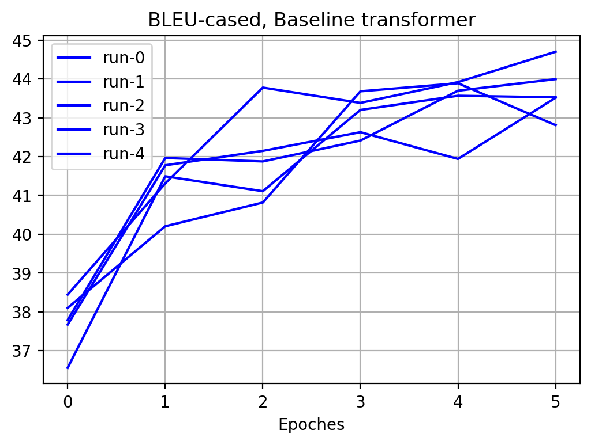

NL2Bash experiment
==================

This document describes the results of applying [TensorFlow official
Trnasformer][1] of the to the [NL2Bash][5] dataset introduced by Xi Victoria Lin
et al. in their paper [Nl2Bash: Corpus and Semantic Parser for Natural Language
Interface to the Linux Operating System][2]. We use [StagedML][3] library for
experiment management.

The primary goal of this work is to demonstrate the features of StagedML
library. The secondary goal is to evaluate the NL2BASH dataset.

We would like to highlight the following facts:

1. The sinppets of top-level code are only one-screen long. At the same time, it
   allows the programmer to change every aspect of the experiment by connecting
   stages together and tweaking their parameters.
2. StagedML caches the results of running stages by creating immutable objects
   in the Pylightnix storage. Configurations and training results are
   accessible to users via [Pylightnix][4] API.
3. Consequently, the rendering of the experiment reports may be largely authomatized.
   In this work, we generated reports from scrath by running a `Makefile` in the
   [/run/nl2bash](/run/nl2bash) directory.

The source code of this report is
[available](https://github.com/stagedml/stagedml/tree/master/run/nl2bash/Report.md.in)
in the StagedML repository. We use [PWeave](http://mpastell.com/pweave) to
render this report.

Imports
-------


```python
import numpy as np
import matplotlib.pyplot as plt

from itertools import islice
from pylightnix import (
    RRef, Path, realize, instantiate, redefine, mkconfig, promise, rref2dref,
    mksymlink, rref2path, mklens, match_best )
from stagedml.imports import ( environ, join, environ, makedirs )
from stagedml.stages.all import ( transformer_wmt, all_nl2bashsubtok,
    all_fetchnl2bash )
from analyze import ( read_tensorflow_log,  vocab_size, model_size )
```


```


### The Model

In this work, we trained a close copy of TensorFlow Official Transformer model.
The model is defined using top-level Keras API and is located in the
[transformer_wmt.py](/src/stagedml/stages/transformer_wmt.py) file. There we
define the `TransformerBuild` class for storing the mutable state and the number
of operations, including `build`, `train`, `evaluate`, etc for actions of the
same name.  Every operation typically accepts `TransformerBuild` object and the
index of the model instance.

Finally, we define `transformer_wmt` which wraps those actions into Pylightnix
Stage entity. Experiments also use other stages for fetching raw dataset and
encoding it using Subtokenizer. Arguments of the `transformer_wmt` stage are:

- `m` Pylightnix dependency resolution context.
- `wmt:WmtSubtok` reference to upstream stage providing a tokenizer. This stage
  is in fact depends on `all_fetchnl2bash` stage which deploys raw dataset.
- `num_instances:int=1` the number of model instances to train.


### Dataset

We print top 5 lines of input and target sentences of the Dataset.


```python
rref=realize(instantiate(all_fetchnl2bash))

with open(mklens(rref).train_input_combined.syspath) as inp, \
     open(mklens(rref).train_target_combined.syspath) as tgt:
  for i, (iline, tline) in islice(enumerate(zip(inp,tgt)),5):
    print(f"#{i}\t[I] {iline.strip()}\n\t[T] {tline.strip()}")
```

```
#0	[I] Pass numbers 1 to 100000 as arguments to "/bin/true"
	[T] /bin/true $(seq 1 100000)
#1	[I] Replace "foo" with "bar" in all PHP files in the current directory tree
	[T] find . -name "*.php" -exec sed -i 's/foo/bar/g' {} \;
#2	[I] Search the entire file hierarchy for files ending in '.old' and delete them.
	[T] find / -name "*.old" -delete
#3	[I] Find all directories under /path/to/Dir and set their permission to 755
	[T] sudo find /path/to/Dir -type d -print0 | xargs -0 sudo chmod 755
#4	[I] run "tar -xzvf ..." as user $username
	[T] su $username -c tar xzvf ..
```


### Metrics

We use BLEU metrics to report the model performance. Bleu implementation is
taken in from official Trnasformer model. This metric may differs from the
version of BLEU which were used by the authors of NL2BASH paper, so we can't
compare results directly.

We applied the metrics to the evaluation subset of the NL2Bash dataset which is
a `0.1` part of the original dataset.

Experiments
-----------

1. [Baseline Transformer](#baseline-transformer) -  use default upstream settings
2. [Unshuffled Transformer](#unshuffled-transformer) -  don't shuffle the dataset
3. [Bash specific tokens](#bash-specific-tokens) - add all commands and flags to
   the list of subtokens
4. [Changing vocabulary size](#changing-vocabulary-size) - try different target
   sizes of vocabulary
5. [Single-char punctuation tokens](#single-char-punctuation-tokens) - suppress
   multichar punktuation subtokens

### Baseline transformer

Below we define the top-level code which sets task-specific parameters of the
`transformer_wmt` stage.


```python
from pylightnix import ( RRef, realizeMany, instantiate, redefine, mkconfig,
    mksymlink, match_some )
from stagedml.stages.all import transformer_wmt, all_nl2bashsubtok

def baseline_subtok(m):
  return all_nl2bashsubtok(m, shuffle=True,
                              with_bash_charset=False,
                              with_bash_subtokens=False)

def baseline_transformer(m):
  def _config(c):
    c['train_steps']=6*5000
    c['params']['beam_size']=3 # As in Tellina paper
    return mkconfig(c)
  return redefine(transformer_wmt,
                  new_config=_config,
                  new_matcher=match_some())(m, baseline_subtok(m), num_instances=5)
```


#### Vocabulary size

Vocabulary size of the baseline model is 5833.

#### Model size

The size of the model is not saved as a specieal part of the model output, but
we have defined a small function which reads it via Keras API.

The number of trainable weights of baseline model is
47090688 parameters.


#### Evaluation

We now display the BLEU metrics of the model during first 6 training epoches.


```python
plt.figure(1)
plt.xlabel("Training steps")
plt.title("BLEU-cased, Baseline transformer")

out=join(environ['STAGEDML_ROOT'],'_experiments','nl2bash','baseline')
makedirs(out, exist_ok=True)
summary_baseline_bleu=[]
for i,rref in enumerate(realizeMany(instantiate(baseline_transformer))):
  mksymlink(rref, out, f'run-{i}', withtime=False)
  baseline_bleu=read_tensorflow_log(join(rref2path(rref),'eval'), 'bleu_cased')
  plt.plot(range(len(baseline_bleu)), baseline_bleu, label=f'run-{i}', color='blue')
  summary_baseline_bleu.append((vocab_size(baseline_transformer),baseline_bleu[4]))

plt.legend(loc='upper left', frameon=True)
plt.grid(True)
```

\


The evaluation code blocks are much similar from experiment to experiment, so we
don't include it in the rendered version of the report. We now select the best baseline transformer


```python
rref=realize(instantiate(redefine(baseline_transformer,new_matcher=match_best('bleu.txt'))))
baseline_bleu=read_tensorflow_log(join(rref2path(rref),'eval'), 'bleu_cased')
```


### Unshuffled dataset

This experiment was in fact a first attempt to run the model. As we can see,
unshuffled dataset reduces the model's performance significantly. All other runs
of the model do use shuffled dataset.


```python
def unshuffled_subtok(m):
  return all_nl2bashsubtok(m, shuffle=False,
                              with_bash_charset=False,
                              with_bash_subtokens=False)

def unshuffled_transformer(m):
  def _config(c):
    c['train_steps']=6*5000
    c['params']['beam_size']=3 # As in Tellina paper
    return mkconfig(c)
  return redefine(transformer_wmt,_config)(m, unshuffled_subtok(m))
```


\


### Bash-specific tokens

Originally this experiment was intended to run the model with bash-specific
tokens _and_ different vocabulary sizes. Unfortunately, due to subtokenizer API
misuse, we in fact measured the performance on the same target vocabulary. We
will make the corrections in the next experiment and here we display just the
effect of adding bash-specific tokens.

Adding the bash-specifics include:

1. Changing the Master Character Set of the Subtokenizer by adding
   `['-','+',',','.']` to the default list of Alphanumeric characters
2. Pre-parsing the train part of BASH dataset and generating the list of
   reserved subtokens. The list includes:
    - First words of every command. Often those are command names.
    - All words starting from `-`. Often those are flags of bash commands.


```python
def run1(vsize:int)->RRef:

  def mysubtok(m):
    def _config(d):
      d['target_vocab_size']=vsize  # Doesn't in fact depend on this parameter
      d['vocab_file'] = [promise, 'vocab.%d' % vsize]
      return mkconfig(d)
    return redefine(all_nl2bashsubtok, _config)(m,
                    shuffle=True, with_bash_charset=True, with_bash_subtokens=True)

  def mytransformer(m):
    def _config(c):
      c['train_steps']=5*5000
      c['params']['beam_size']=3 # As in Tellina paper
      return mkconfig(c)
    return redefine(transformer_wmt,_config)(m, mysubtok(m))

  return mysubtok, mytransformer
```


Results:


\


### Changing vocabulary size of Baseline model

We set the target size of the subtoken vocabulary to different values in range
`[1000, 15000]`.

Model config:


```python
def run(vsize:int):
  def mysubtok(m):
    def _config(d):
      d['target_vocab_size']=vsize
      d['vocab_file'] = [promise, 'vocab.%d' % vsize]
      d['train_data_min_count']=None
      d['file_byte_limit'] = 1e6 if vsize > 5000 else 1e5
      return mkconfig(d)
    return redefine(all_nl2bashsubtok,_config)(m,
      shuffle=True, with_bash_charset=False, with_bash_subtokens=False)

  def mytransformer(m):
    def _config(c):
      c['train_steps']=6*5000
      c['params']['beam_size']=3 # As in Tellina paper
      return mkconfig(c)
    return redefine(transformer_wmt,_config)(m, mysubtok(m))

  return mysubtok, mytransformer
```


Results:


\


### Changing vocabulary size of Bashtoken model

We set the target size of the subtoken vocabulary to different values in range
`[1000, 15000]`.

Model config:


```python
def run2(vsize:int)->None:
  def mysubtok(m):
    def _config(d):
      d['target_vocab_size']=vsize
      d['vocab_file'] = [promise, 'vocab.%d' % vsize]
      d['train_data_min_count']=None
      d['file_byte_limit'] = 1e6 if vsize > 5000 else 1e5
      return mkconfig(d)
    return redefine(all_nl2bashsubtok,_config)(m,
      shuffle=True, with_bash_charset=True, with_bash_subtokens=True)

  def mytransformer(m):
    def _config(c):
      c['train_steps']=6*5000
      c['params']['beam_size']=3 # As in Tellina paper
      return mkconfig(c)
    return redefine(transformer_wmt,_config)(m, mysubtok(m))

  return mysubtok, mytransformer
```


Results:


\


### Single-char punctuation tokens

We now attempt to force the tokenizer to produce single-char tokens for
punctuation chars. This would result in no complex tokens like `'; /` in the
vocabulary.


```python
def singlechar_subtok(m):
  vsize=10000
  def _config(d):
    d['target_vocab_size']=vsize
    d['vocab_file'] = [promise, 'vocab.%d' % vsize]
    d['no_slave_multichar'] = True
    d['train_data_min_count']=None
    return mkconfig(d)
  return redefine(all_nl2bashsubtok,_config)(m)

def singlechar_transformer(m):
  def _config(c):
    c['train_steps']=6*5000
    c['params']['beam_size']=3 # As in Tellina paper
    return mkconfig(c)
  return redefine(transformer_wmt,
                  new_config=_config,
                  new_matcher=match_some())(m, singlechar_subtok(m), num_instances=5)
```


Results:


\


### Summary


\


Unfortunately, suppressing punktuation seems to have no effect or the effect is
negative.


[1]: https://github.com/tensorflow/models/tree/master/official/nlp/transformer
[2]: https://arxiv.org/abs/1802.08979
[3]: https://github.com/stagedml/stagedml
[4]: https://github.com/stagedml/pylightnix
[5]: https://github.com/stagedml/nl2bash_essence/tree/master/src/data/bash
