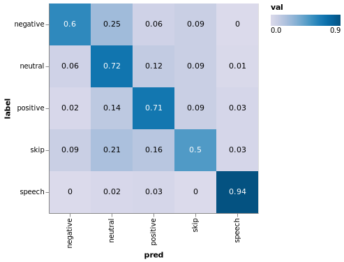

# RuSentiment

In this report we fine-tune multilingual BERT model on a RuSentiment
dataset for Russian language sentiment analysis. We highlight the usage
of [StagedML](https://github.com/stagedml/stagedml) primitives for
constucting models and running experiments.

Resources and related work:

  - [RuSentiment project by Text-Machine
    Lab](http://text-machine.cs.uml.edu/projects/rusentiment/)
      - [Sentiment Annotation Guidelines at
        GitHub](https://github.com/text-machine-lab/rusentiment)
      - [PwC
        page](https://paperswithcode.com/paper/rusentiment-an-enriched-sentiment-analysis)
  - [Dostoevsky project by Bureaucratic
    Labs](https://github.com/bureaucratic-labs/dostoevsky)
      - [Dostoevsky project
        report](https://freesoft.dev/program/132766342)
  - [Multilingual BERT by Google
    Research](https://github.com/google-research/bert/blob/master/multilingual.md)

<!-- end list -->

``` python numberLines
import altair as alt
import pandas as pd
import numpy as np
from rusentiment_experiment import *
from stagedml.stages.all import *
```

## BERT Fine-tuning

We fine-tuned the following BERT models on a RuSentiment dataset:

1.  Multilingual BERT by Google Research, with different learning rates.
2.  Ranomly initialized BERT without pre-training.

Multilingual BERT model is defined based on
`all_multibert_finetune_rusentiment` stage of StagedML. We change some
default
parameters.

``` python numberLines
def all_multibert_finetune_rusentiment1(m:Manager, lr:Optional[float]=None):
  lr_ = lr if lr is not None else learning_rates[0]
  def _nc(c):
    mklens(c).name.val='rusent-pretrained'
    mklens(c).train_batch_size.val=8
    mklens(c).train_epoches.val=5
    mklens(c).lr.val=lr_
  return redefine(all_multibert_finetune_rusentiment, new_config=_nc)(m) # end1
```

Dependency graph of this stage illustrates entities we are going to
calculate in this experiment:

``` python numberLines
with prepare_markdown_image('rusent_graph.png') as path:
  depgraph([all_multibert_finetune_rusentiment1], path)
```


Here,

  - `basebert-multi-cased` is a stage which downloads multilingual BERT
    checkpoint published by Google Research.
  - `fetchrusent` stage downloads the RuSentiment dataset.
    Unfortunately, this dataset is no longer available in public, so we
    are using our private copy.
  - `tfrecord-rusent` converts the Dataset to the TensorFlow Records
    format.
  - `rusent-pretrained` stage creates the BERT model, loads the
    pretrained checkpoint and performs the fine-tuning on the
    RuSentiment TFRecords.
  - Stages mentioned above are declared in the [StagedML top-level
    collection](https://github.com/stagedml/stagedml/blob/master/src/stagedml/stages/all.py)

We define randomly-initialized BERT by disabling the initialization of
the default version of the above model:

``` python numberLines
def all_multibert_finetune_rusentiment0(m:Manager):
  def _nc(c):
    mklens(c).name.val='rusent-random'
    mklens(c).bert_ckpt_in.val=None
  return redefine(all_multibert_finetune_rusentiment1, new_config=_nc)(m) #end0
```

We will train models with a number of different learning rates:

``` python numberLines
print(learning_rates)
```

``` stdout
[2e-05, 5e-05, 0.0001]
```

``` python numberLines
rref0=realize(instantiate(all_multibert_finetune_rusentiment0))
rrefs=[realize(instantiate(all_multibert_finetune_rusentiment1,lr=lr)) \
                           for lr in learning_rates]
```

For every model trained, we read it’s validation logs and plot the
accuracy.

``` python numberLines
cols={'steps':[],'accuracy':[],'name':[],'lr':[]}
for rref in [rref0]+rrefs:
  es=tensorboard_tensors(rref,'valid','accuracy')
  assert len(es)>0
  cols['steps'].extend([e.step for e in es])
  cols['accuracy'].extend([te2float(e) for e in es])
  cols['name'].extend([mklens(rref).name.val for _ in es])
  cols['lr'].extend([mklens(rref).lr.val for _ in es])
altair_print(alt.Chart(DataFrame(cols)).mark_line().encode(
  x='steps', y='accuracy', color='lr:N', strokeDash='name'), f'accuracy.png')
```


``` python numberLines
t=BeautifulTable(max_width=1000)
t.set_style(BeautifulTable.STYLE_MARKDOWN)
t.width_exceed_policy=BeautifulTable.WEP_ELLIPSIS
t.column_headers=['Learning rate','Accuracy']
t.numeric_precision=6
for rref in rrefs:
  t.append_row([str(mklens(rref).lr.val),
                te2float(tensorboard_tensors(rref,'eval','eval_accuracy')[-1])])
print(t)
```

| Learning rate | Accuracy |
| ------------- | -------- |
| 2e-05         | 0.711957 |
| 5e-05         | 0.710938 |
| 0.0001        | 0.679348 |

## Confusion matrix

We build confusion matrix by (a) defininig a simple model runner and (b)
realizing a stage which uses this runner to calculate the matrix data.
Model runner loads the model referenced by `rref` and process a list of
sentences defined by the user.

``` python numberLines
class Runner:
  def __init__(self, rref:RRef):
    self.rref=rref
    self.tokenizer=FullTokenizer(
      vocab_file=mklens(rref).tfrecs.bert_vocab.syspath,
      do_lower_case=mklens(rref).tfrecs.lower_case.val)
    self.max_seq_length=mklens(rref).max_seq_length.val
    self.model=BertClsModel(
      BuildArgs(rref2dref(rref), store_context(rref), None, {}, {}))
    bert_finetune_build(self.model)
    self.model.model.load_weights(mklens(rref).checkpoint_full.syspath)

  def eval(self, sentences:List[str], batch_size:int=10)->List[List[float]]:

    @tf.function
    def _tf_step(inputs):
      return self.model.model_eval(inputs, training=False)

    def _step(inputs:List[Tuple[Any,Any,Any]]):
      return _tf_step((tf.constant([i[0] for i in inputs], dtype=tf.int64),
                       tf.constant([i[1] for i in inputs], dtype=tf.int64),
                       tf.constant([i[2] for i in inputs], dtype=tf.int64)))\
             .numpy().tolist()

    buf=[]
    outs:List[List[float]]=[]
    for i,s in enumerate(sentences):
      ie=InputExample(guid=f"eval_{i:04d}", text_a=s, label='dummy')
      f=convert_single_example(
        10, ie, ['dummy'], self.max_seq_length, self.tokenizer)
      buf.append((f.input_ids, f.input_mask, f.segment_ids))
      if len(buf)>=batch_size:
        outs.extend(_step(buf))
        buf=[]

    outs.extend(_step(buf))
    return outs

# runner ends
```

Stage for calculating the confusion matrix data is defined as follows:

``` python numberLines
def bert_rusentiment_evaluation(m:Manager, stage:Stage)->DRef:

  def _realize(b:Build):
    build_setoutpaths(b,1)
    r=Runner(mklens(b).model.rref)
    df=read_csv(mklens(b).model.tfrecs.refdataset.output_tests.syspath)
    labels=sorted(df['label'].value_counts().keys())
    df['pred']=[labels[np.argmax(probs)] for probs in r.eval(list(df['text']))]
    confusion={l:{l2:0.0 for l2 in labels} for l in labels}
    for i,row in df.iterrows():
      confusion[row['label']][row['pred']]+=1.0
    confusion={l:{l2:i/sum(items.values()) for l2,i in items.items()} \
               for l,items in confusion.items()}
    with open(mklens(b).confusion_matrix.syspath,'w') as f:
      json_dump(confusion,f,indent=4)
    df.to_csv(mklens(b).prediction.syspath)

  return mkdrv(m, matcher=match_only(), realizer=build_wrapper(_realize),
    config=mkconfig({
      'name':'confusion_matrix',
      'model':stage(m),
      'confusion_matrix':[promise, 'confusion_matrix.json'],
      'prediction':[promise, 'prediction.csv'],
      'version':2,
      }))

# eval ends
```

We combine a confusion matrix stage with best stage defined in the
previous section. The final stage function will be contained in
`stage_cm`
variable:

``` python numberLines
stage_finetune=partial(all_multibert_finetune_rusentiment1, lr=min(learning_rates))
stage_cm=partial(bert_rusentiment_evaluation, stage=stage_finetune)
```

Dependency graph of the combined stage became:

``` python numberLines
with prepare_markdown_image('cm_graph.png') as path:
  depgraph([stage_cm], path)
```


Finally, we realize the confusion matrix stage and print the matrix

``` python numberLines
rref=realize(instantiate(stage_cm))
data:dict={'label':[],'pred':[],'val':[]}
for l,items in readjson(mklens(rref).confusion_matrix.syspath).items():
  for l2,val in items.items():
    data['label'].append(l)
    data['pred'].append(l2)
    data['val'].append(f"{val:.2f}")

base=alt.Chart(DataFrame(data))
r=base.mark_rect().encode(
  y='label:O',x='pred:O', # color='val:Q'
  color=alt.Color('val:Q',
        scale=alt.Scale(scheme='purpleblue'),
        legend=alt.Legend(direction='horizontal')
  ))
t=base.mark_text().encode(y='label:O',x='pred:O',text='val:Q',
    color=alt.condition(
        alt.datum.val < 0.5,
        alt.value('black'),
        alt.value('white')
    )
)
altair_print((r+t).properties(width=300,height=300), 'cm.png')
```


